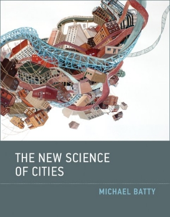

 
PhD proposal
 
 
Dynamics of the Urban Metabolism
 
Joao Meirelles
 
 
Supervisor: Prof. Dr. Claudia Binder
 
Co-supervisor: Dr. Emanuele Massaro

---
 
 
 
 
 
urban world

+++
 
 
 
3%  of world’s land surface
 
54%  of global population
 
80%  of global GDP
 
75%  of natural resources consumption
 
[24]]

+++
the world is going urban
 
 

herus based on UN data

+++
as cities grow bigger, they become    denser
 
 

plan b

+++
as cities grow bigger, they become    richer
 
 

herus based on WB data

+++
as cities grow bigger, they become    more unequal
 
 

herus based on WB data

+++
as cities grow bigger, they become    more impactful
 
 

herus based on GFN data

+++
as cities grow bigger, they become    less impactful
 

[49]]

---
 
 
 
 
?
 
what will be the environmental impacts of an urban world
 
?

+++

cities, data, and complex systems
 
 

 
the form and the function of urban systems are engendered by universal laws that emerge from elementary local level interactions[8, 13, 27, 37]

+++
cities, data, and complex systems
 
 

 
superlinear scaling  of socioeconomic output

sublinear scaling  of infrastructure

+++
cities, data, and complex systems - gaps
 

 
still missing empirical confirmation / a broader scope
 
still missing explanations for the residuals
 
still missing a mechanistic understanding

+++
urban metabolism
 
 

 
"...the interactions of urban systems with nature"[22]

+++
urban metabolism - gaps
 
 
different methods, aims and scopes
 
 
still limited in scope - direct flows
 
 
data problems - temporal and spatial scales
 
 
missing a bottom-up understanding of it

+++
research gaps
 
1. Urban metabolism studies are, largely, limited to direct material flows, not taking into account upstream and downstream environmental impacts related to those flows

 
2. A general - and potentially universal - relation between the urban metabolism and the population size of the city (Brand’s laws) is still lacking stronger empirical evidence
 
3. Commonly used datasets have coarse-grained temporal and spatial definitions, making it hard to explore the role of demographic, economic, infrastructure, and environmental profiles of cities in their metabolism 
 
4. The metabolism of cities is typically studied as a linear reactor at the city level scale. There is a lack of explanations on how the metabolic features could emerge from citizen level interactions/decisions in relations to local environmental/infrastructural constraints

 
5. There is a lack of integrative mechanistic understanding of urban metabolism, which leads to a lack of understanding of its dynamics

+++
framework
 

+++
hypothesis
 

 
1 - The so-called Brand’s law[8]- increasing efficiency of cities due to agglomeration effects - is
only observed if the flows studied are limited to direct consumption.

+++
hypothesis
 

 
2 - Metabolic flows are very unlikely to be linearly related to population or any other urban
variable and this non-linearity is emerging from local level interactions, which potentially indicates regularities throughout cities.

+++
hypothesis
 
 
3 - The sublinear scaling of infrastructure variables might be dependent on the cities’ capacity for investing in it - Environmental Kuznets Curve

 
 
4 - It is possible that the fundamental materiality of cities, with population density and service
availability, generates higher consumption patterns due to marketing, retail availability and social interactions.

 
 
5 - It could be the case that the technological innovations provided by cities are not enough to overcome its overconsumption due to economic development. Especially if rebound effects are considered.

---
proposal
 

+++
proposal
 

---
 
 
 
 
 
step 1 - measuring

+++
step 1 - what have been done
 
 
Global Urban Metabolism Database
 

+++
step 1 - what have been done
 
 
LCA-based Urban Metabolism
 

+++
step 1 - what will be done
 
 
A comprehensive, general, replicable and computational way of assessing the environmental impact of cities

 
 
method: Economic Input-Output Life Cycle Assessment(EIO-LCA)
 
 
data: Infrastructure (OSM, Satellite); Energy (FOEN, ANP); Material flows (Insurance data for durable goods, waste data for non-durable goods)

+++
step 1 - what will be done
 
 
 
expected outcomes: 
 
Urban Environmental impact quantification through Economic Input-Output Life Cycle Assessment - Journal of Industrial Ecology; The International Journal of Life Cycle Assessment; International Society for Industrial Ecology Conference

---
 
 
 
 
 
step 2 - general trend

+++
step 2 - what have been done
 
 
Scaling laws in Brazilian Cities
 

+++
step 2 - what will be done
 
 
Find if there is a
general scaling law behind the environmental impact of cities

 
 
method: Scaling Analyzis [36], Exponent robustness analyzis
 
 
data: Environemntal Impact indicaros calculates in step 1 and population of cities

+++
step 2 - what will be done
 
 
 
expected outcomes: 
 
Scaling laws of the Urban Metabolism - PNAS ; PlosOne; Royal Socienty Open Science

---
 
 
 
 
 
step 3 - specific trends

+++
step 3 - what have been done
 
Exploring the energy use drivers of 10 cities at microscale level
 

+++
step 3 - what will be done
 
 
Find other drivers of
the Urban Metabolism
 
 
method: exploratory analyzis (distributions, scatter plots, correlation, principal component analysis) and predictive model (regression, decision tree, clustering)
 
 
data: Environemntal Impact indicaros calculates in step 1 and Socioeconomic, Infrastructural and Geographical indicators of cities

+++
step 3 - what will be done
 
 
 
expected outcomes: 
 
Recognizing Drivers of the urbam metabolism through machine learning - Environmental Plan B ; Cities and the Environment; Future Cities and Environment

---
 
 
 
 
 
step 4 - mechanistic understanding

+++
step 4 - what have been done
 
 
Urban scaling laws based on distance dependent interactions
 

+++
step 4 - what have been done
 
 
The role of space in social organisation
 

+++
step 4 - what will be done
 
 
Causal explanations for the evolution of the urban metabolism, what if scenarios exploration
 
 
method: ABM + cellular automata

two submodels to be coupled afterwards

+++
step 4 - what will be done
 
 
Infrastructure growth submodel: This can be based on previous models of urban growth and should reflect the fractal and scaling nature of cities [9, 40]. In what regards the out-of-boundaries infrastructure, the cellular automata will simulate supply sources and international markets, which should have a spatial distribution similar to those found in real world. With the population growth, some of those sources may not meet the city’s demands anymore, forcing new infrastructure/trades to be created, leading to different and, possibly, phase transitions in their environmental impacts.

expected outcomes: 
 
Modeling the growth of the urban infrastructure - Environmental Plan B ; JASSS ; Computers, Environment and Urban Systems

+++
step 4 - what will be done
 
 
Consumption submodel: agents will consume different types of goods and services on a time-step basis. The environmental impacts associated with this consumption will be calculated on a time-step basis as well. The consumption pattern (probability distributions) will be dependent on factors recognized on the data analysis part of the Ph.D. (infrastructure availability, spatial distribution of services, social interactions). With the population growth, those patterns might change, leading to different environmental impacts. To include the drivers of the social relations building blocks of the urban metabolism, agents must be situated in an environment and must keep spatial relations among them.

expected outcomes: 
 
Modeling consumption patterns in urban systems - Environmental Plan B ; JASSS ; Computers, Environment and Urban Systems

+++
step 4 - what will be done
 
 
Final model: The two submodels will be coupled to generate a comprehensive and general overview of the dynamics of the urban metabolism. As the population of agents grows, the total environmental
impacts will be calculated from the LSA-based method proposed on Step 1 for both the infrastructure and the goods/services consumption. The model will be validated against findings from the literature and from previous steps of this research. As some examples, the internal infrastructure should scale sublinearly with the population[13] and income increase should lead
to an asymptotic increase in energy consumption. Rebound effects will be studied in this model as well.

expected outcomes: 
 
Modeling LCA-based Urban Metabolism with ABM- Environmental Plan B ; JASSS ; Computers, Environment and Urban Systems; International Workshop on Agent-based modelling of urban systems

---
schedule

---
Bibliography
[1] L. G. Alves, H. V. Ribeiro, E. K. Lenzi, and R. S. Mendes. Distance to the scaling law: a useful approach for unveiling relationships between crime and urban metrics. Plos one, 8(8):e69580, 2013.
[2] P. W. Anderson et al. More is different. Science, 177(4047):393–396, 1972. 
[3] E. Arcaute, E. Hatna, P. Ferguson, H. Youn, A. Johansson, and M. Batty. Constructing cities, deconstructing scaling laws. Journal of The Royal Society Interface, 12(102):20140745, 2015.
[4] E. Arcaute, H. Youn, P. Ferguson, E. Hatna, M. Batty, and A. Johansson. City boundaries and the universality of scaling laws. Technical report, 2013.
[5] A. Athanassiadisa, G. Fernandez, F. Meirelles, Joao andMeinherz, P. Hoekman, and Y. Bettignies. Exploring the energy use drivers of 10 cities at microscale level. Energy Procedia, 2017.
[6] S. Barles. The main characteristics of urban socio-ecological trajectories: Paris (france) from the 18th to the 20th century. Ecological Economics, 118:177–185, 2015.
[7] M. Batty. Cities and complexity: understanding cities with cellular automata, agent-based models, and fractals. The MIT press, 2007.
[8] M. Batty. The new science of cities. Mit Press, 2013.
[9] M. Batty and P. Longley. The fractal city. Architectural Design, 67:74–83, 1997.
[10] L. Bettencourt, J. Lobo, and H. Youn. The hypothesis of urban scaling: formalization, implications and challenges. arXiv preprint arXiv:1301.5919, 2013.
[11] L. Bettencourt and G. West. A unified theory of urban living. Nature, 467(7318):912–913, 2010.
[12] L. M. Bettencourt. The kind of problem a city is. Die Stadt Entschlusseln: Wie Echtzeitdaten Den Urbanismus Verandern: Wie Echtzeitdaten den Urbanismus verändern, pages 175–187, 2013.
[13] L. M. Bettencourt. The origins of scaling in cities. science, 340(6139):1438–1441, 2013.
[14] L. M. Bettencourt, J. Lobo, D. Helbing, C. Kühnert, and G. B. West. Growth, innovation, scaling, and the pace of life in cities. Proceedings of the national academy of sciences,104(17):7301–7306, 2007.
[15] L. M. Bettencourt and G. B. West. Bigger cities do more with less. Scientific American,305(3):52–53, 2011.
[16] C. Brelsforda, J. Lobo, J. Handa, and L. Bettencourt. Heterogeneity and scale of sustainable development in cities. Proceedings of the National Academy of Sciences, 2017.
[17] M. A. Brown, F. Southworth, and A. Sarzynski. Shrinking the carbon footprint of metropolitan America. Brookings Institution Washington, DC, 2008.
[18] P. H. Brunner. Beyond materials flow analysis. Journal of Industrial Ecology, 6(1):8–10,2002.
[19] P. H. Brunner. Reshaping urban metabolism. na, 2007.
[20] A. Clauset, C. R. Shalizi, and M. E. Newman. Power-law distributions in empirical data.SIAM review, 51(4):661–703, 2009.
[21] C. Cottineau, E. Hatna, E. Arcaute, and M. Batty. Diverse cities or the systematic paradoxof urban scaling laws. Computers, Environment and Urban Systems, 63:80–94, 2017.
[22] P. Ferrão and J. E. Fernández. Sustainable urban metabolism. MIT press, 2013.
[23] M. Fragkias, J. Lobo, D. Strumsky, and K. C. Seto. Does size matter? scaling of co2 emissions and us urban areas. PLoS One, 8(6):e64727, 2013.
[24] H. Girardet. Giant footprints. Our Planet, 8(1):21–23, 1996.
[25] E. L. Glaeser and M. E. Kahn. The greenness of cities: carbon dioxide emissions and urban development. Journal of urban economics, 67(3):404–418, 2010.
[26] B. Goldstein, M. Birkved, M.-B. Quitzau, and M. Hauschild. Quantification of urban metabolism through coupling with the life cycle assessment framework: concept development and case study. Environmental Research Letters, 8(3):035024, 2013.
[27] A. Gomez-Lievano, O. Patterson-Lomba, and R. Hausmann. Explaining the prevalence, scaling and variance of urban phenomena. Nature Human Behaviour, 1, 2016.
[28] A. Gomez-Lievano, H. Youn, and L. M. Bettencourt. The statistics of urban scaling and their connection to zipf’s law. PLoS One, 7(7):e40393, 2012.
[29] U. Habitat. State of the world’s cities 2012/2013: Prosperity of cities. Routledge, 2013.
[30] C. Hendrickson, A. Horvath, S. Joshi, and L. Lave. Economic input-output models for environmental life-cycle assessment. Environmental science & technology, 32(7):184, 1998.
[31] C. T. Hendrickson, L. B. Lave, and H. S. Matthews. Environmental life cycle assessment of goods and services: an input-output approach. Resources for the Future, 2006.
[32] J. Jacobs. The death and life of great American cities. Vintage, 2016.
[33] C. Jones and D. M. Kammen. Spatial distribution of us household carbon footprints reveals suburbanization undermines greenhouse gas benefits of urban population density. Environmental science & technology, 48(2):895–902, 2014.
[34] C. A. Kennedy, I. Stewart, A. Facchini, I. Cersosimo, R. Mele, B. Chen, M. Uda, A. Kansal,A. Chiu, K.-g. Kim, et al. Energy and material flows of megacities. Proceedings of the National Academy of Sciences, 112(19):5985–5990, 2015.
[35] J. Ladyman, J. Lambert, and K. Wiesner. What is a complex system? European Journal for Philosophy of Science, 3(1):33–67, 2013.
[36] J. C. Leitão, J. M. Miotto, M. Gerlach, and E. G. Altmann. Is this scaling nonlinear? Royal Society Open Science, 3(7):150649, 2016.
[37] R. Lemoy and G. Caruso. Scaling evidence of the homothetic nature of cities. arXiv preprint arXiv:1704.06508, 2017.
[38] B. Lester. Plan b 4.0: Mobilizing to save civilization new york. NY WW Norton, 2009. 
[39] R. Louf and M. Barthelemy. Scaling: lost in the smog. Environment and Planning B: Planning and Design, 41(5):767–769, 2014.
[40] H. A. Makse, S. Havlin, and H. E. Stanley. Modelling urban growth patterns. Nature, 377(6550):608, 1995.
[41] V. M. Netto, J. V. Meirelles, and F. L. Ribeiro. Social organisation and the city: The role of space in the reduction of social entropy. 2017.
[42] P. G. Newman and J. R. Kenworthy. Cities and automobile dependence: An international sourcebook. 1989.
[43] E. A. Oliveira, J. S. Andrade Jr, and H. A. Makse. Large cities are less green. arXiv preprint arXiv:1401.7720, 2014.
[44] S. G. Ortman, A. H. Cabaniss, J. O. Sturm, and L. M. Bettencourt. The pre-history of urban scaling. PloS one, 9(2):e87902, 2014.
[45] F. L. Ribeiro, J. Meirelles, F. F. Ferreira, and C. R. Neto. A model of urban scaling laws based on distance dependent interactions. Royal Society Open Science, 4(3):160926, 2017.
[46] D. Rybski, D. E. Reusser, A.-L. Winz, C. Fichtner, T. Sterzel, and J. P. Kropp. Cities as nuclei of sustainability? Environment and Planning B: Planning and Design, page 0265813516638340, 2014.
[47] A. N. D. Saldivar-Sali. A global typology of cities: Classification tree analysis of urban resource consumption. PhD thesis, Massachusetts Institute of Technology, 2010.
[48] L. Sanchez. Impacto ambiental, avaliação, conceitos e métodos. Editora Oficina de Textos, São Paulo, 2006.
[49] A. Sarzynski. Bigger is not always better: a comparative analysis of cities and their air pollution impact. Urban Studies, 49(14):3121–3138, 2012.
[50] E. Strano and V. Sood. Rich and poor cities in europe. an urban scaling approach to mapping the european economic transition. PloS one, 11(8):e0159465, 2016.
[51] H. Weisz, S. Suh, and T. Graedel. Industrial ecology: The role of manufactured capital in sustainability. Proceedings of the National Academy of Sciences, 112(20):6260–6264, 2015.
[52] A. Wolman. The metabolism of cities. Scientific American, 213(3):179–190, 1965.

---
 
 
 
 

 
thanks

