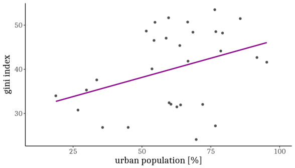

 
PhD proposal
 
Dynamics of the Urban Metabolism
 
Joao Meirelles
 
Supervisor: Prof. Dr. Claudia Binder
Co-supervisor: Dr. Emanuele Massaro

---

global footprint network

---

herus

---
urban world

+++

herus

+++
the world is going urban

herus

+++
as cities grow bigger, they become    denser

plan b

+++
as cities grow bigger, they become    richer

herus

+++
as cities grow bigger, they become    more unequal

herus

+++
as cities grow bigger, they become    more impactful

herus

---
urban impacts: 
  what are it's drivers and dynamics?

+++
the urban metabolism

herus

+++
e.g.:    dynamics of the urban metabolism

herus

+++
e.g.:    dynamics of the urban metabolism

herus

+++
e.g.:    drivers of energy consumption

herus

---
urban sustainability: 
  what can be done to change this trends?

+++
transition processes

herus

+++
e.g.:    room for improvement in material flows

herus

+++
e.g.:    transition to a sustainable energy use: 

herus

+++
e.g.:    transition to decentralized regional energy autonomy

herus

+++
e.g.:    transition to decentralized regional energy autonomy

herus

+++
e.g.:    transition to decentralized regional energy autonomy

herus

+++
e.g.:    transition to decentralized regional energy autonomy

herus

---
